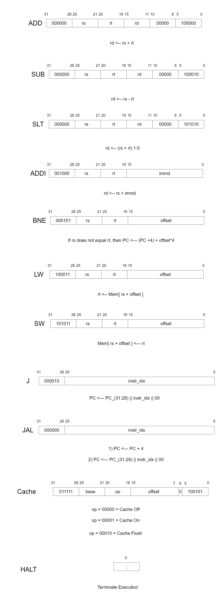

# Python-CPU-Simulator
I created a CPU simulator in Python. Where the CPU is made up of a program counter register, instructions register, the Control Unit(CU), and the Arithmetic Logic Unit (ALU). The ALU is different here such that it contains the cache and main memory. With my beginner's understanding of a CPU, I made a diagram that shows the control flow of a CPU.

Where the grey arrows are unidirectional and the blue arrows are bidirectional. This helped me construct the Python CPU simulator that has its CU and ALU as classes and the registers for PC and instructions are an initialized number and a list, respectively. The ALU class has the Main memory class and Cache class inside it because both memory storages live outside the CPU and the ALU is the one exchanging signals. The following classes have the function of:

* CPU class is thus a class that has initialized registers, the CU class, and the ALU class. This class uses all the functions of its initialized classes to decide the control flow.
* CU class takes individual instructions to decode.
* ALU class has functions that do the arithmetic and logical operations, a data retrieval involving cache hit/miss, a helper function to create a readable binary string, the Cache class, and the main memory class.
* Cache class has data retrieval functions that involve a FIFO-replacement policy, and a initialized dictionary for storing data.
* Main Memory class has to store, write, and loading functions for initialized data list.

The instruction is decoded using a personalized Instruction Set Architecture modeled by MIPS architecture, as shown below.

