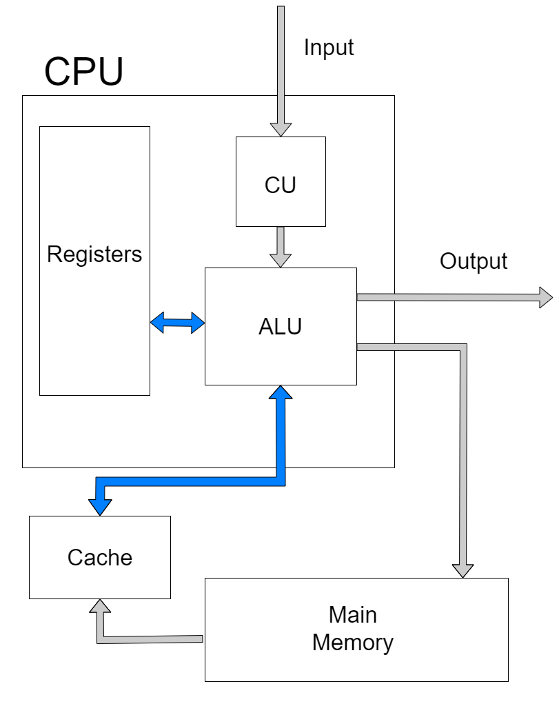

# Python-CPU-Simulator
I created a CPU simulator in Python. Where the CPU is made up of a program counter register, the Control Unit(CU), and the Arithmetic Logic Unit (ALU). The ALU is different here such that it contains the cache and main memory. With my beginner's understanding of a CPU, I made a diagram that shows the control flow of a CPU.

